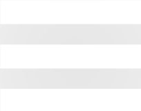

# Projet CV en ligne

- #### Un projet avec un design sobre et moderne

  

  J'ai fait beaucoup d'effort sur ce projet pour qu'il parraisse moderne et montre mes avancées en design et en CSS.  J'ai opté pour une marge globale afin de simuler une application mobile.D'où le design du button menu (non fonctionnel pour l'instant). Le site est entièrement en anglais car il me paraît important dans un monde aussi ouvert que le developement web, de montrer que le language n'est pas un problème pour moi. Pour l'instant le site fait assez vide, mais j'y travaille. J'essaie de prendre mon temps pour être sûr que le résultat finale me corresponde.

  

- #### Une organisation nouvelle pour moi

  > Sur ce projet, j'utilise énormément le SCSS comme vous pouvez le voir. J'ai voulu essayer une nouvelle organisation pour pouvoir mieux m'y retrouver et ne pas avoir une énorme page CSS dans laquelle je serais complètement perdu. Je me suis donc inspiré de l'**Architecture en 7-1** (Un peu simplifié pour ce petit projet). Ainsi que des **classes optimisé pour l'utilisation du SCSS.**  

  ```html
  <header class="header">
        <p class="header-title">/Erwan.Coubel</p>
        
        <section class="header-main">
          <h2 class="header-description">
            Welcome to my personal <span class="header-span">website</span>
          </h2>
          <section class="header-gif">
            
          </section>
        </section>
      </header>
  ```

  ##### En SCSS celà me permet de pouvoir simplifier le tout: 

  ```scss
  .header {
    background: linear-gradient(to top left, #e66465, #9198e5);
    height: 100vh;
    position: relative;
    font-weight: 100;
    font-size: 3rem;
    border-radius: 30px 30px 0 0;
    animation: moveInUp 1s;
    &-menu-burger {
      position: absolute;
      top: 3rem;
      left: 90vw;
      height: 4rem;
      animation: moveInRight 2s;
    }
    &-main {
      margin-top: 10vh;
      text-align: center;
      animation: moveInUp 2s;
    }
    &-span {
      font-weight: 500;
    }
    &-description {
      font-size: 6rem;
      margin-bottom: 2rem;
    }
    &-title {
      padding: 3rem;
      animation: moveInLeft 2s;
    }
  
    &-gif img {
      height: 50rem;
      border-radius: 30px;
    }
  }
  ```

  

- #### Un design responsive avec les media queries

  > J'ai découvert les **media queries** avec ce projet, cette exercice bien qu'assez long m'a vraiment plus. Je trouve ça plus sympa à utiliser que *bootstrap*. La personnalisation selon chaque appareil n'a pas de limite. Cependant, j'ai encore l'impression de ne pas l'optimisé.. Je pense pouvoir simplifier mon code, mais j'en suis pas moins fier !

  ```scss
  @media screen and (max-width: 320px) {
    body {
      margin: 0;
    }
  
    .header {
      height: 70vh;
      font-size: 1rem;
      border-radius: 0;
      &-menu-burger {
        left: 85vw;
        height: 2rem;
      }
      &-description {
        font-size: 2rem;
      }
      &-gif img {
        height: 15rem;
      }
      &-title {
        font-size: 2rem;
      }
    }
  
    .main {
      display: block;
      padding: 1rem;
      &-subtitle {
        font-size: 2rem;
        margin-top: 2rem;
      }
      &-content {
        font-size: 1rem;
      }
      &-center-top img {
        height: 10rem;
      }
      &-center,
      &-center-bottom,
      &-right {
        margin-top: 3rem;
      }
      &-left {
        margin-top: 0;
      }
      &-left-top p {
        margin-top: 0;
      }
      &-right {
        display: flex;
        justify-content: space-around;
      }
    }
  
    .footer {
      height: 70vh;
      border-radius: 0;
    }
  }
  ```

- #### Les animations en CSS

  > Première utilisation également des animations CSS. Rien de très impressionnant mais ça rend vraiment un meilleur rendu je trouve. Cependant, j'ai un eu un peu de mal pour les animations du bloc CV. Effectivement j'ai du utiliser une **API (prochaines et dernières puces ⬇️)**

  ```css
  @keyframes moveInLeft {
    0% {
      opacity: 0;
      transform: translateX(-10rem);
    }
  
    100% {
      opacity: 1;
      transform: translate(0);
    }
  }
  ```

- #### Utilisation d'une API en JavaScript pour animer le contenue au scroll de la page

  > En effet, je voulais absolument intégré des animations qui se déclanche au moment où l'on arrive sur l'élement. J'ai donc cherché sur *stackoverflow*, et je suis tombé sur une solution. L'utilisation de l'**API Intersection Observer,** alors j'ai rechercher des explications et pris 30minutes à chercher sur VSCode comment l'utiliser avec un "querySelectorAll" car j'avais plusieurs éléments a observer.. Et j'ai réussi !

  ```javascript
  const ratio = 0.1;
  
  const options = {
    root: null,
    rootMargin: "0px",
    threshold: ratio,
  };
  
  const callback = function (entries, observer) {
    entries.forEach(function (entry) {
      if (entry.intersectionRatio > ratio) {
        entry.target.classList.add("onscroll-left");
        console.log("visible");
        // observer.unobserve(entry.target);
      } else {
        entry.target.classList.remove("onscroll-left");
      }
    });
  };
  
  const observer = new IntersectionObserver(callback, options);
  document.querySelectorAll(".main-content").forEach(function (s) {
    observer.observe(s);
  });
  
  ```


#### 		Le site est disponible ***[ici.](http://erwancoubel.tech/)*** (toujours en construction)

​		

